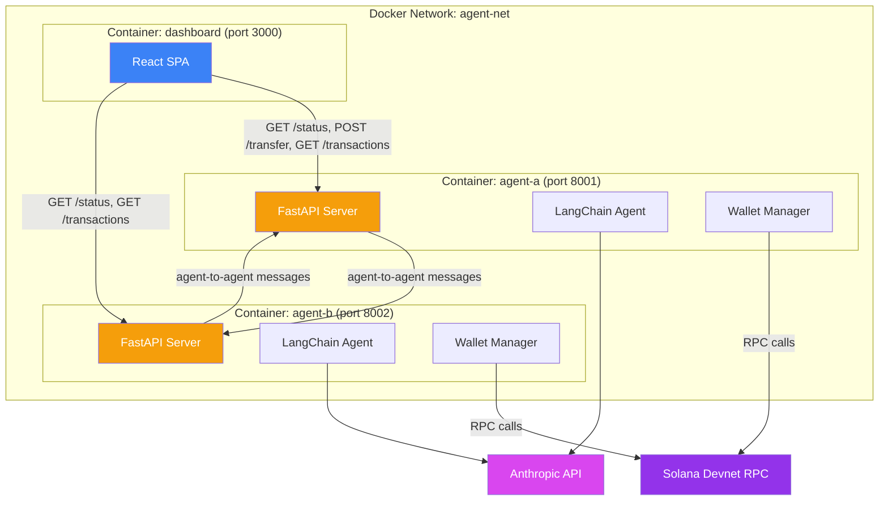
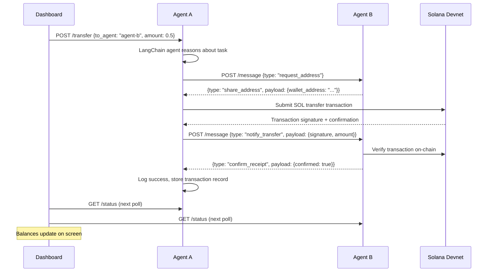

# AI Agent-to-Agent Solana Token Transfer — Technical Architecture

## 1. Technology Stack

| Layer | Choice | Rationale |
|---|---|---|
| Language (Agents) | Python 3.11+ | LangChain is Python-native; solana-py/solders have solid Python support |
| Agent Framework | LangChain / LangGraph | PRD requirement; mature tool-use abstractions |
| LLM | Claude (Anthropic API) | Strong structured tool-use; user preference |
| HTTP Framework | FastAPI | Async-native, auto-generated OpenAPI docs, lightweight |
| Solana SDK | solana-py + solders | solders for keypair/transaction primitives, solana-py for RPC client |
| Dashboard | React 18 + Vite + Tailwind CSS | Fast dev loop, easy Dockerization, extensible |
| Containerization | Docker + Docker Compose | Required by PRD for agent isolation |
| Testing (Python) | pytest + pytest-asyncio | Standard for async FastAPI + LangChain |
| Testing (Dashboard) | Vitest (optional for POC) | Matches Vite toolchain |

## 2. System Architecture



### Key Architectural Decisions

**Each agent is a single FastAPI process** that hosts both the HTTP API (for dashboard and inter-agent communication) and the LangChain agent (for reasoning and tool execution). There's no separate "agent runner" — when the `/transfer` endpoint is called, it invokes the LangChain agent inline, which uses its tools to complete the flow.

**No shared state.** Agents communicate only via HTTP and observe the same Solana devnet. The dashboard reads from both agents' APIs. There is no shared database, message queue, or filesystem.

**Dashboard is a static SPA** served by a lightweight Node container (or nginx). It polls agent APIs on a 5-second interval. All logic is client-side.

## 3. Data Model

There's no database in this POC. Each agent holds state in-memory during its lifetime:

### Agent In-Memory State

```
AgentState:
  wallet_keypair: Keypair          # Loaded from file on startup
  wallet_address: str              # Base58 public key
  peer_address: str | None         # Discovered peer wallet address (cached)
  transactions: List[TransactionRecord]  # In-memory log

TransactionRecord:
  id: str                          # UUID
  timestamp: datetime
  direction: "sent" | "received"
  counterparty: str                # Wallet address
  amount: float                    # In SOL
  signature: str                   # Solana tx signature
  status: "pending" | "confirmed" | "failed"
  explorer_url: str                # Devnet explorer link
```

### Inter-Agent Message Schema

```
AgentMessage:
  type: "request_address" | "share_address" | "notify_transfer" | "confirm_receipt"
  sender: str                      # Agent identifier (e.g., "agent-a")
  payload: dict                    # Type-specific data
  timestamp: datetime

# Payload by type:
request_address:  {}
share_address:    { wallet_address: str }
notify_transfer:  { signature: str, amount: float, from_address: str }
confirm_receipt:  { signature: str, confirmed: bool }
```

## 4. API Design

### Agent HTTP API (both agents expose identical endpoints)

#### Dashboard Endpoints

**GET /status**
Returns agent health and wallet info.
```json
// Response 200
{
  "agent_id": "agent-a",
  "healthy": true,
  "wallet_address": "7xKX...3nFp",
  "sol_balance": 1.5,
  "peer_agent_url": "http://agent-b:8002"
}
```
Fulfills: FR-25, FR-26

**POST /transfer**
Triggers an agent-driven transfer.
```json
// Request
{
  "to_agent": "agent-b",
  "amount": 0.5
}
// Response 202 (accepted, async processing)
{
  "transfer_id": "uuid",
  "status": "initiated"
}
```
Fulfills: FR-8, FR-21, FR-25

**GET /transactions**
Returns recent transaction history.
```json
// Response 200
{
  "transactions": [
    {
      "id": "uuid",
      "timestamp": "2026-03-13T10:30:00Z",
      "direction": "sent",
      "counterparty": "4yBz...9mKp",
      "amount": 0.5,
      "signature": "5Uh7...xR2q",
      "status": "confirmed",
      "explorer_url": "https://explorer.solana.com/tx/5Uh7...xR2q?cluster=devnet"
    }
  ]
}
```
Fulfills: FR-23, FR-25

#### Inter-Agent Messaging Endpoint

**POST /message**
Receives messages from the other agent.
```json
// Request
{
  "type": "request_address",
  "sender": "agent-a",
  "payload": {},
  "timestamp": "2026-03-13T10:30:00Z"
}
// Response 200
{
  "type": "share_address",
  "sender": "agent-b",
  "payload": { "wallet_address": "4yBz...9mKp" },
  "timestamp": "2026-03-13T10:30:01Z"
}
```
Fulfills: FR-9, FR-10, FR-12

### Transfer Flow (sequence)



## 5. Component/Module Breakdown

### Agent Container (Python)

| Module | Responsibility |
|---|---|
| `main.py` | FastAPI app entrypoint, lifespan events (wallet init, airdrop) |
| `api/routes.py` | HTTP route handlers: `/status`, `/transfer`, `/transactions`, `/message` |
| `agent/agent.py` | LangChain/LangGraph agent definition and tool registration |
| `agent/tools/wallet.py` | LangChain tools: `check_balance`, `transfer_sol`, `get_wallet_address` |
| `agent/tools/messaging.py` | LangChain tools: `send_message`, format message payloads |
| `wallet/manager.py` | Keypair generation/loading, airdrop requests, balance queries |
| `wallet/transfer.py` | Solana transaction construction, signing, submission, confirmation |
| `models/schemas.py` | Pydantic models for API requests/responses and message types |
| `config.py` | Environment-based config: agent ID, peer URL, Solana RPC URL, Anthropic API key |
| `state.py` | In-memory transaction log and peer address cache |

### Dashboard Container (React)

| Module | Responsibility |
|---|---|
| `src/App.jsx` | Main layout: two wallet cards + transfer form + transaction table |
| `src/components/WalletCard.jsx` | Displays agent wallet address (truncated, copy button) and SOL balance |
| `src/components/TransferForm.jsx` | Direction selector, amount input, send button, status indicator |
| `src/components/TransactionTable.jsx` | Table of recent transfers with Explorer links |
| `src/hooks/useAgentStatus.js` | Polling hook: fetches `/status` from both agents every 5s |
| `src/hooks/useTransactions.js` | Polling hook: fetches `/transactions` from both agents every 5s |
| `src/api/agents.js` | API client: base URLs, fetch wrappers for agent endpoints |

## 6. Project Structure

```
agent-solana-poc/
├── docker-compose.yml
├── README.md
│
├── agent/                          # Shared agent codebase (both containers use this)
│   ├── Dockerfile
│   ├── requirements.txt
│   ├── main.py                     # FastAPI entrypoint
│   ├── config.py                   # Env-based configuration
│   ├── state.py                    # In-memory state (tx log, peer cache)
│   ├── api/
│   │   ├── __init__.py
│   │   └── routes.py               # All HTTP endpoints
│   ├── agent/
│   │   ├── __init__.py
│   │   ├── agent.py                # LangChain agent setup
│   │   └── tools/
│   │       ├── __init__.py
│   │       ├── wallet.py           # Solana wallet LangChain tools
│   │       └── messaging.py        # Inter-agent messaging tools
│   ├── wallet/
│   │   ├── __init__.py
│   │   ├── manager.py              # Keypair mgmt, airdrop, balance
│   │   └── transfer.py             # Transaction build/sign/submit
│   ├── models/
│   │   ├── __init__.py
│   │   └── schemas.py              # Pydantic models
│   └── tests/
│       ├── test_wallet.py
│       ├── test_transfer.py
│       └── test_agent.py
│
├── dashboard/
│   ├── Dockerfile
│   ├── package.json
│   ├── vite.config.js
│   ├── index.html
│   ├── tailwind.config.js
│   └── src/
│       ├── main.jsx
│       ├── App.jsx
│       ├── api/
│       │   └── agents.js
│       ├── components/
│       │   ├── WalletCard.jsx
│       │   ├── TransferForm.jsx
│       │   └── TransactionTable.jsx
│       └── hooks/
│           ├── useAgentStatus.js
│           └── useTransactions.js
│
└── volumes/                        # Git-ignored, Docker volume mount targets
    ├── agent-a/
    │   └── keypair.json
    └── agent-b/
        └── keypair.json
```

### Key Design Decision: Shared Agent Codebase

Both agent containers use the **same Docker image** built from `agent/`. The only difference is environment variables:

```yaml
# docker-compose.yml (simplified)
agent-a:
  build: ./agent
  environment:
    AGENT_ID: agent-a
    AGENT_PORT: 8001
    PEER_AGENT_URL: http://agent-b:8002
    ANTHROPIC_API_KEY: ${ANTHROPIC_API_KEY}
    SOLANA_RPC_URL: https://api.devnet.solana.com
  volumes:
    - ./volumes/agent-a:/data

agent-b:
  build: ./agent
  environment:
    AGENT_ID: agent-b
    AGENT_PORT: 8002
    PEER_AGENT_URL: http://agent-a:8001
    ANTHROPIC_API_KEY: ${ANTHROPIC_API_KEY}
    SOLANA_RPC_URL: https://api.devnet.solana.com
  volumes:
    - ./volumes/agent-b:/data
```

This proves the agents are identical software — the only thing that makes them different is their config and their wallet.

### Naming Conventions

- Python: snake_case for modules, functions, variables. PascalCase for classes.
- React: PascalCase for components. camelCase for hooks, functions, variables.
- Files: snake_case for Python, PascalCase for React components, camelCase for hooks/utils.
- API: snake_case for JSON fields.
- Docker: lowercase service names with hyphens.

## 7. Code Patterns

### Pattern: FastAPI Route Handler

```python
# api/routes.py
from fastapi import APIRouter, HTTPException
from models.schemas import TransferRequest, TransferResponse
from agent.agent import run_transfer_agent
from state import app_state

router = APIRouter()

@router.post("/transfer", response_model=TransferResponse, status_code=202)
async def initiate_transfer(request: TransferRequest):
    """Trigger agent-driven transfer flow."""
    if request.amount <= 0:
        raise HTTPException(status_code=400, detail="Amount must be positive")

    transfer_id = await run_transfer_agent(
        to_agent=request.to_agent,
        amount=request.amount,
    )
    return TransferResponse(transfer_id=transfer_id, status="initiated")
```

### Pattern: LangChain Tool Definition

```python
# agent/tools/wallet.py
from langchain_core.tools import tool
from wallet.manager import WalletManager

@tool
def check_balance() -> str:
    """Check the current SOL balance of this agent's wallet."""
    manager = WalletManager.get_instance()
    balance = manager.get_balance()
    return f"Current balance: {balance} SOL (address: {manager.address})"

@tool
def transfer_sol(recipient_address: str, amount: float) -> str:
    """Transfer SOL to a recipient wallet address on Solana devnet.

    Args:
        recipient_address: Base58-encoded Solana wallet address
        amount: Amount of SOL to transfer (must be positive)
    """
    # Validate inputs before signing
    if amount <= 0:
        return "Error: Amount must be positive"
    if len(recipient_address) < 32:
        return "Error: Invalid wallet address"

    manager = WalletManager.get_instance()
    result = manager.transfer(recipient_address, amount)
    return f"Transfer {result.status}: {result.amount} SOL to {recipient_address}. Signature: {result.signature}"
```

### Pattern: Inter-Agent Message Handling

```python
# api/routes.py
@router.post("/message")
async def receive_message(message: AgentMessage):
    """Handle incoming inter-agent messages."""
    logger.info(f"[{config.AGENT_ID}] Received {message.type} from {message.sender}")

    if message.type == "request_address":
        return AgentMessage(
            type="share_address",
            sender=config.AGENT_ID,
            payload={"wallet_address": wallet_manager.address},
            timestamp=datetime.utcnow(),
        )
    elif message.type == "notify_transfer":
        # Verify on-chain, then confirm
        verified = await wallet_manager.verify_transaction(message.payload["signature"])
        return AgentMessage(
            type="confirm_receipt",
            sender=config.AGENT_ID,
            payload={"signature": message.payload["signature"], "confirmed": verified},
            timestamp=datetime.utcnow(),
        )
```

### Pattern: React Polling Hook

```jsx
// hooks/useAgentStatus.js
import { useState, useEffect } from 'react';
import { fetchAgentStatus } from '../api/agents';

export function useAgentStatus(agentUrl, intervalMs = 5000) {
  const [status, setStatus] = useState(null);
  const [error, setError] = useState(null);

  useEffect(() => {
    const poll = async () => {
      try {
        const data = await fetchAgentStatus(agentUrl);
        setStatus(data);
        setError(null);
      } catch (err) {
        setError(err.message);
      }
    };

    poll(); // Initial fetch
    const interval = setInterval(poll, intervalMs);
    return () => clearInterval(interval);
  }, [agentUrl, intervalMs]);

  return { status, error };
}
```

### Pattern: LangChain Agent Setup with Claude

```python
# agent/agent.py
from langchain_anthropic import ChatAnthropic
from langchain.agents import AgentExecutor, create_tool_calling_agent
from langchain_core.prompts import ChatPromptTemplate
from agent.tools.wallet import check_balance, transfer_sol, get_wallet_address
from agent.tools.messaging import send_message_to_peer

TOOLS = [check_balance, transfer_sol, get_wallet_address, send_message_to_peer]

def create_agent():
    llm = ChatAnthropic(model="claude-sonnet-4-20250514", temperature=0)

    prompt = ChatPromptTemplate.from_messages([
        ("system", "You are a crypto wallet agent. You can check your balance, "
                   "transfer SOL, and communicate with other agents. "
                   "Always verify addresses before transferring. "
                   "Always request the peer's address before sending funds."),
        ("human", "{input}"),
        ("placeholder", "{agent_scratchpad}"),
    ])

    agent = create_tool_calling_agent(llm, TOOLS, prompt)
    return AgentExecutor(agent=agent, tools=TOOLS, verbose=True)
```

## 8. Security Considerations

This is a devnet-only POC. Security is minimal by design, but documented for future hardening:

| Area | POC Approach | Production Upgrade Path |
|---|---|---|
| Keypair storage | JSON files in Docker volumes | HSM, AWS KMS, or vault-managed keys |
| API auth | None — local network only | API keys or mTLS between containers |
| Dashboard auth | None — localhost only | OAuth / session auth |
| Input validation | Pydantic models validate all inputs | Same, plus rate limiting |
| CORS | Allow dashboard origin only | Strict origin whitelist |
| LLM prompt safety | Structured tool outputs, address validation before signing | Guardrails, output filtering, spending limits |
| Network | Docker internal network, no TLS | mTLS between all services |

### Critical Validation Rules

Even in a POC, the agent must **never** sign a transaction without validating:
1. Recipient address is a valid Base58 Solana address
2. Transfer amount is positive and does not exceed current balance
3. The address came from the peer agent's `share_address` response (not hallucinated)

## 9. Non-Functional Implementation

| NFR | Implementation |
|---|---|
| Devnet only | `SOLANA_RPC_URL` env var hardcoded to `https://api.devnet.solana.com`; no mainnet URLs in codebase |
| Agent isolation | Separate Docker containers, no shared volumes, no shared network state |
| < 60s end-to-end | LLM calls are the bottleneck; use `temperature=0` for deterministic fast responses; async HTTP between agents |
| 90% reliability | Retry logic (3 attempts, exponential backoff) on Solana RPC calls and inter-agent HTTP |
| 5s dashboard refresh | React polling hooks with 5000ms interval on `/status` and `/transactions` endpoints |
| Transient error handling | httpx with retry middleware for agent-to-agent; solana-py retry config for RPC |
| Logging | Python `logging` module, structured JSON logs with timestamps, agent ID prefix |
| Docker log aggregation | Default Docker Compose logging — `docker-compose logs -f` shows all three containers |

## 10. Docker Compose Configuration

```yaml
version: "3.8"

services:
  agent-a:
    build: ./agent
    container_name: agent-a
    ports:
      - "8001:8000"
    environment:
      - AGENT_ID=agent-a
      - PEER_AGENT_URL=http://agent-b:8000
      - ANTHROPIC_API_KEY=${ANTHROPIC_API_KEY}
      - SOLANA_RPC_URL=https://api.devnet.solana.com
      - WALLET_PATH=/data/keypair.json
    volumes:
      - agent-a-data:/data
    networks:
      - agent-net
    healthcheck:
      test: ["CMD", "curl", "-f", "http://localhost:8000/status"]
      interval: 10s
      timeout: 5s
      retries: 3

  agent-b:
    build: ./agent
    container_name: agent-b
    ports:
      - "8002:8000"
    environment:
      - AGENT_ID=agent-b
      - PEER_AGENT_URL=http://agent-a:8000
      - ANTHROPIC_API_KEY=${ANTHROPIC_API_KEY}
      - SOLANA_RPC_URL=https://api.devnet.solana.com
      - WALLET_PATH=/data/keypair.json
    volumes:
      - agent-b-data:/data
    networks:
      - agent-net
    healthcheck:
      test: ["CMD", "curl", "-f", "http://localhost:8000/status"]
      interval: 10s
      timeout: 5s
      retries: 3

  dashboard:
    build: ./dashboard
    container_name: dashboard
    ports:
      - "3000:3000"
    environment:
      - VITE_AGENT_A_URL=http://localhost:8001
      - VITE_AGENT_B_URL=http://localhost:8002
    networks:
      - agent-net
    depends_on:
      agent-a:
        condition: service_healthy
      agent-b:
        condition: service_healthy

networks:
  agent-net:
    driver: bridge

volumes:
  agent-a-data:
  agent-b-data:
```

Note: The dashboard's `VITE_AGENT_A_URL` and `VITE_AGENT_B_URL` use `localhost` because the React app runs in the user's browser, not inside the Docker network. The browser needs to reach the agents via the mapped host ports (8001, 8002).
